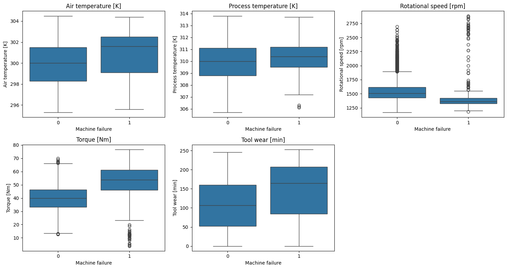
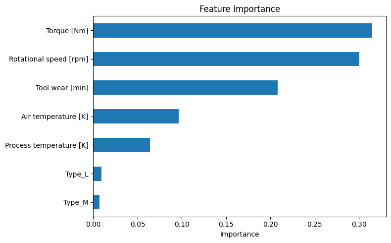
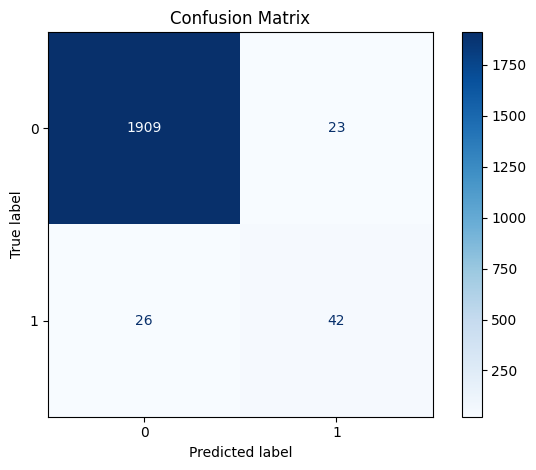

# Predictive Maintenance for Machines

A machine learning system that predicts equipment failure risk from real-time sensor data, served through a REST API with an interactive web dashboard.

**Live Demo**: https://predictive-maintenance-ml-qxv0.onrender.com

*Note: This is hosted on a free-tier service. The first request after a period of inactivity may take 30-50 seconds to respond while the server wakes up.*

## Overview

Unplanned equipment downtime is a major cost in manufacturing and industrial operations. This project demonstrates a complete workflow for predicting machine failure before it happens, using sensor readings such as temperature, torque, rotational speed, and tool wear.

The system consists of three components:

1. A trained classification model that estimates failure probability from sensor inputs
2. A FastAPI backend that serves predictions through a REST API
3. A web dashboard for entering sensor readings and viewing results

## Dataset

This project uses the **AI4I 2020 Predictive Maintenance Dataset** from the UCI Machine Learning Repository. It contains 10,000 records of synthetic industrial sensor data with labeled failure outcomes, including five real failure modes: tool wear failure, heat dissipation failure, power failure, overstrain failure, and random failure.

Key characteristics:
- 10,000 samples, no missing values
- 5 numeric sensor features plus a categorical product quality type (Low / Medium / High)
- Target variable is highly imbalanced: approximately 3.4 percent of samples represent a failure

## Exploratory Data Analysis

The plot below shows how each sensor reading is distributed for normal operation versus failure cases. Failures are clearly associated with higher torque, lower rotational speed, and higher tool wear.



## Model

Two models were trained and compared: a Random Forest classifier and an XGBoost classifier, both with class imbalance handling. XGBoost was selected for production use based on superior recall on the minority (failure) class, which is the more costly error type in a maintenance context.

| Metric | Random Forest | XGBoost (deployed) |
|--------|---------------|---------------------|
| ROC-AUC | 0.967 | 0.971 |
| Precision (failure class) | 0.65 | 0.68 |
| Recall (failure class) | 0.62 | 0.79 |
| F1-score (failure class) | 0.63 | 0.73 |
| Missed failures (false negatives) | 26 / 68 | 14 / 68 |

XGBoost configuration: 200 trees, max depth 5, learning rate 0.1, with `scale_pos_weight` set to the inverse class ratio to address the approximately 3.4 percent failure rate in the training data.

### Feature Importance

Torque, rotational speed, and tool wear are the most influential features in the model, consistent with the physical failure modes present in the dataset. This ranking was consistent across both models.



### Confusion Matrix

The confusion matrix below shows Random Forest performance on the test set, used here as the baseline for comparison against the deployed XGBoost model.



## API

The backend is built with FastAPI and exposes the following endpoints:

| Method | Endpoint   | Description                                  |
|--------|-----------|-----------------------------------------------|
| GET    | /         | Serves the web dashboard                       |
| POST   | /predict  | Returns failure prediction for given sensor input |
| GET    | /docs     | Interactive API documentation (Swagger UI)     |

### Request Format

```json
POST /predict
{
  "air_temperature": 298.1,
  "process_temperature": 308.6,
  "rotational_speed": 1551,
  "torque": 42.8,
  "tool_wear": 0,
  "type": "M"
}
```

### Response Format

```json
{
  "machine_failure_predicted": 0,
  "failure_probability": 0.0069
}
```

## Web Dashboard

The dashboard provides a simple interface for entering sensor readings and viewing the predicted failure risk, along with a brief explanation of the result and guidance on typical value ranges for each input.

## Project Structure
predictive_maintenance/

├── app/

│   └── main.py              # FastAPI application and prediction logic

├── static/

│   └── index.html           # Web dashboard

├── data/

│   └── ai4i2020.csv          # Raw dataset

├── notebooks/

│   └── 01_explore.ipynb      # Data exploration and model training

├── models/

│   ├── rf_model.pkl          # Trained Random Forest model

│   └── feature_columns.pkl   # Feature column order used at inference

├── assets/                    # Visualizations referenced in this document

├── requirements.txt

├── runtime.txt

└── README.md

## Running Locally

### Requirements
- Python 3.13

### Setup

```bash
git clone https://github.com/Stuxxxnett/predictive-maintenance-ml.git
cd predictive-maintenance-ml
python -m venv venv
venv\Scripts\activate
pip install -r requirements.txt
```

### Run the application

```bash
uvicorn app.main:app --reload
```

Visit `http://127.0.0.1:8000` for the dashboard, or `http://127.0.0.1:8000/docs` for the API documentation.

## Deployment

The application is deployed on Render as a Python web service, using the following configuration:

- Build command: `pip install -r requirements.txt`
- Start command: `uvicorn app.main:app --host 0.0.0.0 --port $PORT`
- Python version: 3.13.3

## Limitations and Future Work

This project is intended as a demonstration and learning exercise. Potential extensions include:

- Predicting the specific type of failure rather than a binary outcome
- Comparing alternative models such as gradient boosting methods
- Adding a batch prediction endpoint for processing multiple machines at once
- Simulating a continuous stream of sensor data for real-time monitoring
- Logging predictions for model monitoring and drift detection

## Acknowledgements

Dataset: AI4I 2020 Predictive Maintenance Dataset, UCI Machine Learning Repository.